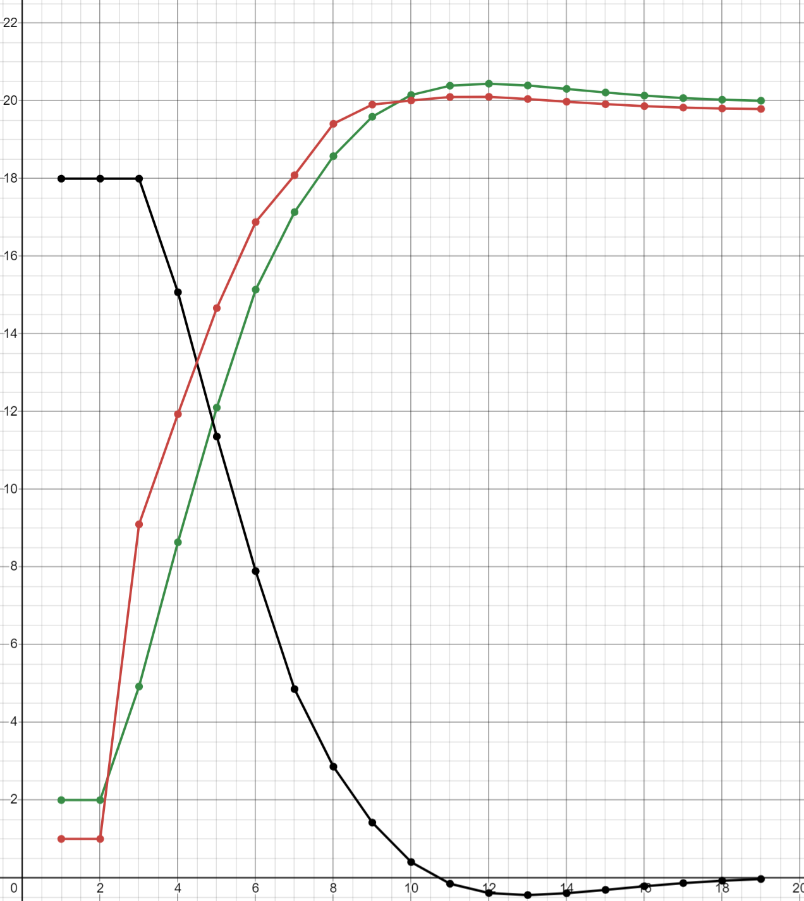

<p align="center"> Министерство образования Республики Беларусь</p>
<p align="center">Учреждение образования</p>
<p align="center">“Брестский Государственный технический университет”</p>
<p align="center">Кафедра ИИТ</p>
<br><br><br><br><br><br><br>
<p align="center">Лабораторная работа №2</p>
<p align="center">По дисциплине “Общая теория интеллектуальных систем”</p>
<p align="center">Тема: “ПИД-регуляторы”</p>
<br><br><br><br><br>
<p align="right">Выполнил:</p>
<p align="right">Студент 2 курса</p>
<p align="right">Группы ИИ-26</p>
<p align="right">Вирко Е.Д.</p>
<p align="right">Проверил:</p>
<p align="right">Ситковец Я. С.</p>
<br><br><br><br><br>
<p align="center">Брест 2024</p>

<hr>

# Общее задание #
1. Написать отчет по выполненной лабораторной работе №1 в .md формате (readme.md) и с помощью запроса на внесение изменений (**pull request**) разместить его в следующем каталоге: **trunk\ii0xxyy\task_02\doc** (где **xx** - номер группы, **yy** - номер студента, например **ii02302**).
2. Исходный код написанной программы разместить в каталоге: **trunk\ii0xxyy\task_02\src**.

# Задание #
Задание. На C++ реализовать программу, моделирующую рассмотренный выше ПИД-регулятор. В качестве объекта управления использовать математическую модель, полученную в предыдущей работе. В отчете также привести графики для разных заданий температуры объекта, пояснить полученные результаты.


<hr>

# Выполнение задания #

Код программы:
```C++
#include <iostream>
#include <cmath>
#include <vector>
#include <iomanip>

// Коэффициенты системы
const double a = 0.9;
const double b = 0.3;
const double c = 0.4;
const double d = 0.1;

// Параметры системы
const double trans_coeff_K = 0.9;
const double time0 = 0.5, timeC = 1.0, timeD = 0.5;
const double req_output = 20;

// Параметры регулятора
const double par1 = trans_coeff_K * (1 + (timeD / time0));
const double par2 = -trans_coeff_K * (1 + 2 * (timeD / time0) - (time0 / timeC));
const double par3 = trans_coeff_K * (timeD / time0);

void RunNonlinearModel() {
    // Начальные значения
    const short int initial_value = 2;
    std::vector<double> model_output = { initial_value, initial_value }; // Вектор результатов модели
    std::vector<double> errors = { req_output - initial_value, req_output - initial_value }; // Вектор ошибок
    double control_signal = 1;
    std::vector<double> control_signals = { control_signal, control_signal }; // Вектор контрольных сигналов

    // Основной цикл моделирования
    while (std::abs(req_output - model_output.back()) > 0.01) {
        // Обновление ошибки
        errors.push_back(req_output - model_output.back());

        // Вычисление контрольного сигнала
        control_signal += par1 * errors.back() + par2 * errors[errors.size() - 2] + par3 * errors[errors.size() - 3];
        control_signals.push_back(control_signal);

        // Обновление результата модели
        model_output.push_back(a * model_output.back() - b * model_output[model_output.size() - 2] + c * control_signal + d * std::sin(control_signals.back()));
    }

    // Вывод результатов
    std::cout << std::right << std::setw(10) << "Итерация"
        << std::setw(10) << "Вывод"
        << std::setw(13) << "Ошибка"
        << std::setw(13) << "Контроль" << std::endl;

    for (size_t i = 0; i < model_output.size(); ++i) {
        std::cout << std::right << std::setw(10) << i + 1
            << std::setw(10) << model_output[i]
            << std::setw(13) << errors[i]
            << std::setw(13) << control_signals[i] << std::endl;
    }
}

int main() {
    setlocale(LC_ALL, "rus");

    RunNonlinearModel();
    return 0;
}
'''
Вывод:
'''
 Итерация     Вывод       Ошибка     Контроль
         1         2           18            1
         2         2           18            1
         3   4.87191           18          9.1
         4   8.54589      15.1281      12.0306
         5   12.2319      11.4541      14.8098
         6   15.0192      7.76815       16.636
         7   17.1799      4.98076      18.4317
         8    18.716      2.82014      19.2926
         9   19.6647      1.28401      19.7411
        10    20.172     0.335297      19.9938
        11    20.384    -0.171992      20.0854
        12   20.4215    -0.383983       20.083
        13   20.3701     -0.42154      20.0334
        14   20.2847    -0.370146        19.97
        15   20.1969    -0.284695       19.911
        16   20.1223     -0.19688       19.864
        17   20.0664    -0.122316      19.8306
        18   20.0286   -0.0663758      19.8092
        19   20.0058   -0.0286035      19.7969
'''
