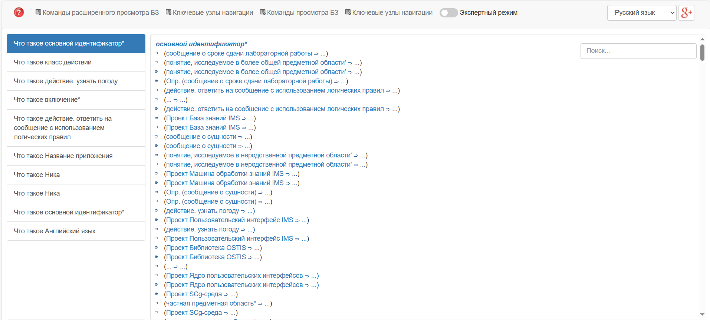
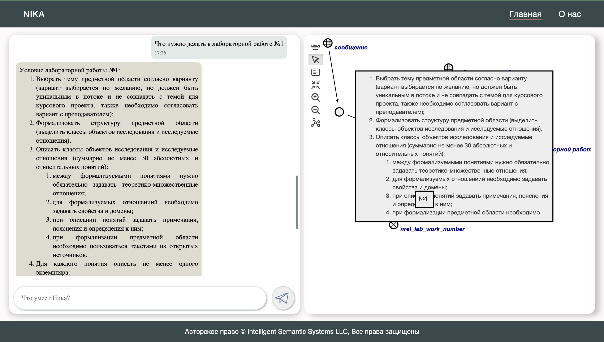

<p align="center"> Министерство образования Республики Беларусь</p>
<p align="center">Учреждение образования</p>
<p align="center">“Брестский Государственный технический университет”</p>
<p align="center">Кафедра ИИТ</p>
<br><br><br><br><br><br><br>
<p align="center">Лабораторная работа №4</p>
<p align="center">По дисциплине “Общая теория интеллектуальных систем”</p>
<p align="center">Тема: “Работа с проектом "NIKA" (Intelligent Knowledge-driven Assistant)”</p>
<br><br><br><br><br>
<p align="right">Выполнил:</p>
<p align="right">Студент 2 курса</p>
<p align="right">Группы ИИ-26</p>
<p align="right">Вирко Е.Д.</p>
<p align="right">Проверила:</p>
<p align="right">Ситковец Я. С.</p>
<br><br><br><br><br>
<p align="center">Брест 2023</p>

---

# Общее задание #
1. Изучить [руководство](https://github.com/ostis-apps/nika).

2. Запустить данный проект на локальной машине (домашний персональный компьютер, ноутбук, рабочая машина в аудитории и т.п.). Продемонстрировать работу проекта преподавателю.

3. Написать отчет по выполненной работе в .md формате (readme.md) и с помощью pull request разместить его в следующем каталоге: trunk\ii0xxyy\task_04\doc.


---

# Установка #

```
git clone -c core.longpaths=true -c core.autocrlf=true https://github.com/ostis-apps/nika
cd nika
git submodule update --init --recursive
docker compose pull
```
Также необходимо дополнительно установить [Docker](https://docs.docker.com/)(c плагином Compose)
 
# Запуск #
```
docker compose up --no-build
```
Эта команда запустит два веб-интерфейса:

sc-web - ```localhost:8000```

dialogue web UI - ```localhost:3033```

# Результат #

sc-web - ```localhost:8000```:



dialogue web UI - ```localhost:3033```:



Docker Desktop:
