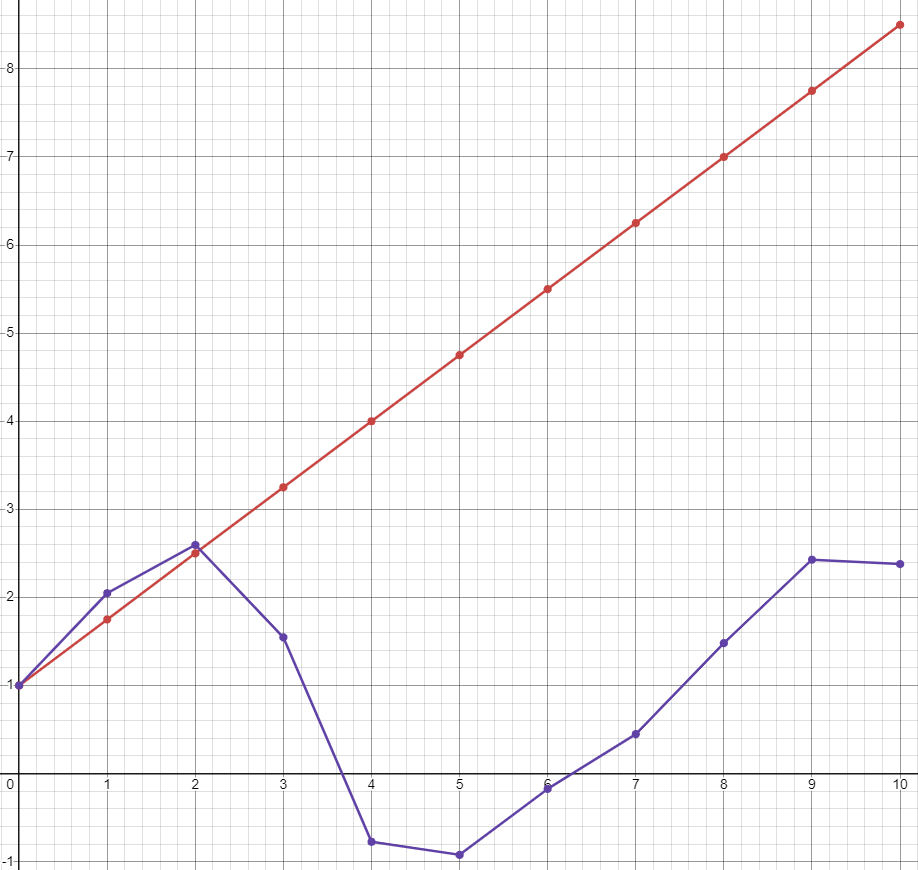

<p align="center"> Министерство образования Республики Беларусь</p>
<p align="center">Учреждение образования</p>
<p align="center">“Брестский Государственный технический университет”</p>
<p align="center">Кафедра ИИТ</p>
<br><br><br><br><br><br><br>
<p align="center">Лабораторная работа №1</p>
<p align="center">По дисциплине “Общая теория интеллектуальных систем”</p>
<p align="center">Тема: “Моделирования температуры объекта”</p>
<br><br><br><br><br>
<p align="right">Выполнил:</p>
<p align="right">Студент 2 курса</p>
<p align="right">Группы ИИ-25</p>
<p align="right">Подгайский Д.А.</p>
<p align="right">Проверила:</p>
<p align="right">Ситковец Я.С.</p>
<br><br><br><br><br>
<p align="center">Брест 2024</p>

<hr>

# Общее задание #
1. Написать отчет по выполненной лабораторной работе №1 в .md формате (readme.md) и с помощью запроса на внесение изменений (**pull request**) разместить его в следующем каталоге: **trunk\ii0xxyy\task_01\doc** (где **xx** - номер группы, **yy** - номер студента, например **ii02102**).
2. Исходный код написанной программы разместить в каталоге: **trunk\ii0xxyy\task_01\src**.
## Task 1. Modeling controlled object ##
Let's get some object to be controlled. We want to control its temperature, which can be described by this differential equation:

$$\Large\frac{dy(\tau)}{d\tau}=\frac{u(\tau)}{C}+\frac{Y_0-y(\tau)}{RC} $$ (1)

where $\tau$ – time; $y(\tau)$ – input temperature; $u(\tau)$ – input warm; $Y_0$ – room temperature; $C,RC$ – some constants.

After transformation, we get these linear (2) and nonlinear (3) models:

$$\Large y_{\tau+1}=ay_{\tau}+bu_{\tau}$$ (2)
$$\Large y_{\tau+1}=ay_{\tau}-by_{\tau-1}^2+cu_{\tau}+d\sin(u_{\tau-1})$$ (3)

where $\tau$ – time discrete moments ($1,2,3{\dots}n$); $a,b,c,d$ – some constants.

Task is to write program (**С++**), which simulates this object temperature.

<hr>

# Выполнение задания #

Код программы:
```C++
#include <iostream>
#include <cmath>

using std::cin;
using std::cout;
using std::endl;

const double A = 0.5;
const double B = 0.01;
const double C = 0.2;
const double D = 0.4;

// Линейная модель
double linearModel(double temp, double control) {
    return A * temp + B * control;
}

// Нелинейная модель
double nonlinearModel(double temp, double control, double prevTemp, double prevControl) {
    return A * temp - B * std::pow(prevTemp, 2) + C * control + D * std::sin(prevControl);
}

int main() {
    setlocale(LC_ALL, "Russian");

    double currentTemp;
    cout << "Введите начальное значение температуры: ";
    cin >> currentTemp;

    double nextTemp = currentTemp;
    double previousTemp;
    double controlSignal = 8.0;
    double previousControlSignal = controlSignal;

    const int iterationCount = 10;

    // Линейная модель
    cout << "\nЛинейная модель:\n";
    cout << "Шаг:\tТемпература\n";
    for (int step = 1; step <= iterationCount; ++step) {
        previousTemp = nextTemp;
        nextTemp = linearModel(previousTemp, controlSignal);
        cout << step << "\t" << nextTemp << endl;
    }

    // Сброс температуры для нелинейной модели
    nextTemp = currentTemp;
    cout << "\nНелинейная модель:\n";
    cout << "Шаг:\tТемпература\n";
    for (int step = 1; step <= iterationCount; ++step) {
        previousTemp = nextTemp;
        nextTemp = nonlinearModel(previousTemp, controlSignal, currentTemp, previousControlSignal);
        cout << step << "\t" << nextTemp << endl;
    }

    return 0;
}
```     
```
Введите начальное значение температуры: 1

Линейная модель:
Шаг:    Температура
1       0.58
2       0.37
3       0.265
4       0.2125
5       0.18625
6       0.173125
7       0.166563
8       0.163281
9       0.161641
10      0.16082

Нелинейная модель:
Шаг:    Температура
1       2.48574
2       3.22861
3       3.60005
4       3.78577
5       3.87863
6       3.92506
7       3.94827
8       3.95988
9       3.96568
10      3.96858
```
