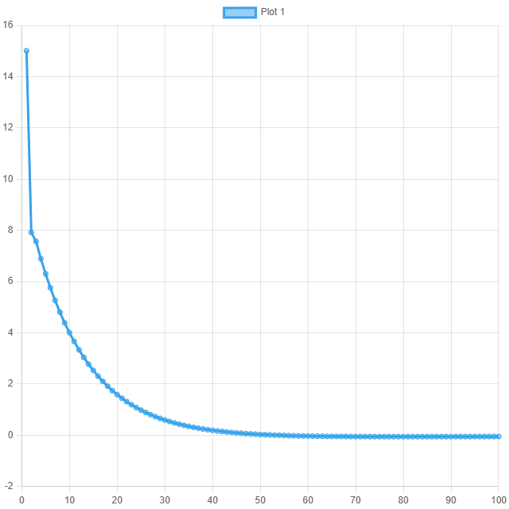

<p align="center"> Министерство образования Республики Беларусь</p>
<p align="center">Учреждение образования</p>
<p align="center">“Брестский Государственный технический университет”</p>
<p align="center">Кафедра ИИТ</p>
<br><br><br><br><br><br><br>
<p align="center">Лабораторная работа №2</p>
<p align="center">По дисциплине “Общая теория интеллектуальных систем”</p>
<p align="center">Тема: “ПИД-регуляторы”</p>
<br><br><br><br><br>
<p align="right">Выполнил:</p>
<p align="right">Студент 2 курса</p>
<p align="right">Группы ИИ-25</p>
<p align="right">Трошин И. Д.</p>
<p align="right">Проверила:</p>
<p align="right">Ситковец Я. С.</p>
<br><br><br><br><br>
<p align="center">Брест 2024</p>

---

# Общее задание #
1. Написать отчет по выполненной лабораторной работе №2 в .md формате (*readme.md*) и с помощью **pull request** разместить его в следующем каталоге: **trunk\ii0xxyy\task_02\doc**.
2. Исходный код написанной программы разместить в каталоге: **trunk\ii0xxyy\task_02\src**.
3. Отразить выполнение работы в файле readme.md в соответствующей строке (например, для студента под порядковым номером 1 - https://github.com/brstu/OTIS-2023/edit/main/readme.md?#L17-L17).

**Задание.**
На **C++** реализовать программу, моделирующую рассмотренный выше ПИД-регулятор.  В качестве объекта управления использовать математическую модель, полученную в предыдущей работе.
В отчете также привести графики для разных заданий температуры объекта, пояснить полученные результаты.

---

# Выполнение задания #

Код программы:
```C++
#include <iostream>

#include <iostream>

struct PIDParameters {
    double kp;
    double ki;
    double kd;
    double K;
    double T;
    double TD;
    double T0;
};

double calculate(double setpoint, double measured_value, double dt, PIDParameters& params, double& previous_error, double& integral) {
    double error = setpoint - measured_value;
    integral += error * dt;
    double derivative = (error - previous_error) / dt;

    double output = params.kp * error + params.ki * integral + params.kd * derivative;

    previous_error = error;
    return output;
}

int main() {
    PIDParameters params = { 1.0, 0.1, 0.05, 0.0001, 100, 100, 1 };

    double setpoint = 100.0;
    double measured_value = 90.0;
    double dt = 0.1;

    double previous_error = 0.0;
    double integral = 0.0;

    for (int i = 0; i < 100; ++i) {
        double control = calculate(setpoint, measured_value, dt, params, previous_error, integral);
        std::cout << control << std::endl;

        measured_value += control * 0.1;
    }

    return 0;
}

```

Результат выполнения программы:

```
15.1
7.9199
7.5639
6.89472
6.30123
5.757
5.25898
4.80318
4.38606
4.00432
3.65499
3.33531
3.04278
2.77511
2.53019
2.30609
2.10105
1.91346
1.74185
1.58485
1.44124
1.30988
1.18973
1.07985
0.979366
0.887479
0.803463
0.726651
0.656434
0.592253
0.533595
0.479994
0.431019
0.38628
0.345417
0.308101
0.274031
0.242931
0.214551
0.188657
0.16504
0.143506
0.123878
0.105993
0.0897038
0.0748739
0.0613791
0.0491057
0.0379494
0.027815
0.0186151
0.0102698
0.00270608
-0.00414307
-0.0103389
-0.0159374
-0.0209901
-0.0255438
-0.0296415
-0.0333226
-0.0366231
-0.0395759
-0.0422113
-0.0445568
-0.0466377
-0.0484771
-0.0500961
-0.0515142
-0.052749
-0.0538167
-0.0547322
-0.055509
-0.0561596
-0.0566952
-0.0571264
-0.0574625
-0.0577123
-0.0578838
-0.0579841
-0.0580199
-0.0579974
-0.0579221
-0.057799
-0.0576328
-0.0574277
-0.0571877
-0.0569162
-0.0566165
-0.0562916
-0.0559442
-0.0555767
-0.0551913
-0.0547902
-0.0543752
-0.0539481
-0.0535103
-0.0530633
-0.0526084
-0.0521467
-0.0516795
```
---

график 

