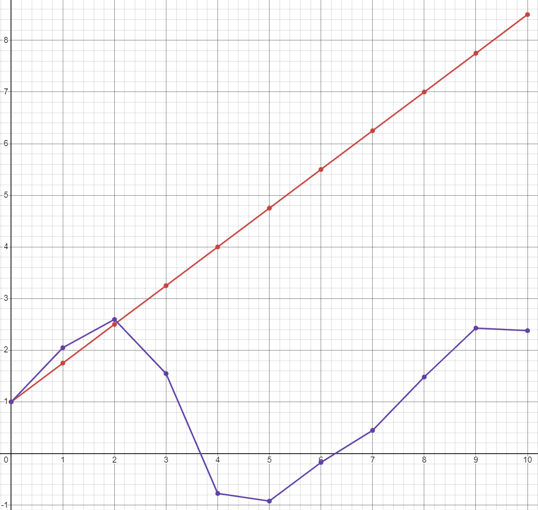

<p align="center"> Министерство образования Республики Беларусь</p>
<p align="center">Учреждение образования</p>
<p align="center">“Брестский Государственный технический университет”</p>
<p align="center">Кафедра ИИТ</p>
<br><br><br><br><br><br><br>
<p align="center">Лабораторная работа №1</p>
<p align="center">По дисциплине “Общая теория интеллектуальных систем”</p>
<p align="center">Тема: “Моделирования температуры объекта”</p>
<br><br><br><br><br>
<p align="right">Выполнил:</p>
<p align="right">Студент 2 курса</p>
<p align="right">Группы ИИ-26</p>
<p align="right">Згера Е.А.</p>
<p align="right">Проверил:</p>
<p align="right">Ситковец Я.С.</p>
<br><br><br><br><br>
<p align="center">Брест 2024</p>

<hr>

# Общее задание #
1. Написать отчет по выполненной лабораторной работе №1 в .md формате (readme.md) и с помощью запроса на внесение изменений (**pull request**) разместить его в следующем каталоге: **trunk\ii0xxyy\task_01\doc** (где **xx** - номер группы, **yy** - номер студента, например **ii02102**).
2. Исходный код написанной программы разместить в каталоге: **trunk\ii0xxyy\task_01\src**.
## Task 1. Modeling controlled object ##
Let's get some object to be controlled. We want to control its temperature, which can be described by this differential equation:

$$\Large\frac{dy(\tau)}{d\tau}=\frac{u(\tau)}{C}+\frac{Y_0-y(\tau)}{RC} $$ (1)

where $\tau$ – time; $y(\tau)$ – input temperature; $u(\tau)$ – input warm; $Y_0$ – room temperature; $C,RC$ – some constants.

After transformation, we get these linear (2) and nonlinear (3) models:

$$\Large y_{\tau+1}=ay_{\tau}+bu_{\tau}$$ (2)
$$\Large y_{\tau+1}=ay_{\tau}-by_{\tau-1}^2+cu_{\tau}+d\sin(u_{\tau-1})$$ (3)

where $\tau$ – time discrete moments ($1,2,3{\dots}n$); $a,b,c,d$ – some constants.

Task is to write program (**Julia**), which simulates this object temperature.

<hr>

# Выполнение задания #

Код программы:
```C++
#include <iostream>
#include <cmath> 

using namespace std;

// Функция для моделирования линейной системы
void linearModelSimulation(double a, double b, double y0, double u0, int n) {
    double yt = y0;  
    double ut = u0;  

    cout << "\n--- Моделирование линейной системы ---\n";
    for (int t = 0; t < n; ++t) {
        double yt_next = a * yt + b * ut;  // Уравнение линейной модели
        cout << "Шаг " << t + 1 << ": y[" << t + 1 << "] = " << yt_next << endl;
        yt = yt_next;
    }
}

// Функция для моделирования нелинейной системы
void nonlinearModelSimulation(double a, double b, double c, double d, double y0, double y_prev, double u0, int n) {
    double yt = y0;           
    double yt_minus1 = y_prev; 
    double ut = u0;           

    cout << "\n--- Моделирование нелинейной системы ---\n";
    for (int t = 0; t < n; ++t) {
        double yt_next = a * yt - b * yt_minus1 * yt_minus1 + c * ut + d * sin(ut - 1);  // Уравнение нелинейной модели
        cout << "Шаг " << t + 1 << ": y[" << t + 1 << "] = " << yt_next << endl;

        yt_minus1 = yt;  
        yt = yt_next;
    }
}

int main() {
    setlocale(LC_ALL, "Russian");
    double a, b, c, d;  
    double y0, u0, y_prev;  
    int n;  

    cout << "Введите константу a: ";
    cin >> a;
    cout << "Введите константу b: ";
    cin >> b;
    cout << "Введите константу c (для нелинейной модели): ";
    cin >> c;
    cout << "Введите константу d (для нелинейной модели): ";
    cin >> d;
    cout << "Введите начальное значение температуры y0: ";
    cin >> y0;                                                      
    //Константы можно было задать вначале
    cout << "Введите начальное значение предыдущей температуры (для нелинейной модели): ";
    cin >> y_prev;
    cout << "Введите начальное значение температуры: ";
    cin >> u0;
    cout << "Введите количество временных шагов n: ";
    cin >> n;

    linearModelSimulation(a, b, y0, u0, n);
    nonlinearModelSimulation(a, b, c, d, y0, y_prev, u0, n);

    return 0;
}
```     
```
Введите константу a: 1
Введите константу b: 2
Введите константу c (для нелинейной модели): 1
Введите константу d (для нелинейной модели): 2
Введите начальное значение температуры y0: 0
Введите начальное значение предыдущей температуры (для нелинейной модели): -1
Введите начальное значение температуры: 0
Введите количество временных шагов n: 10

--- Моделирование линейной системы ---
Шаг 1: y[1] = 0
Шаг 2: y[2] = 0
Шаг 3: y[3] = 0
Шаг 4: y[4] = 0
Шаг 5: y[5] = 0
Шаг 6: y[6] = 0
Шаг 7: y[7] = 0
Шаг 8: y[8] = 0
Шаг 9: y[9] = 0
Шаг 10: y[10] = 0

--- Моделирование нелинейной системы ---
Шаг 1: y[1] = -3.68294
Шаг 2: y[2] = -5.36588
Шаг 3: y[3] = -34.1769
Шаг 4: y[4] = -93.4453
Шаг 5: y[5] = -2431.26
Шаг 6: y[6] = -19897
Шаг 7: y[7] = -1.18419e+07
Шаг 8: y[8] = -8.03622e+08
Шаг 9: y[9] = -2.80462e+14
Шаг 10: y[10] = -1.2919e+18
```

