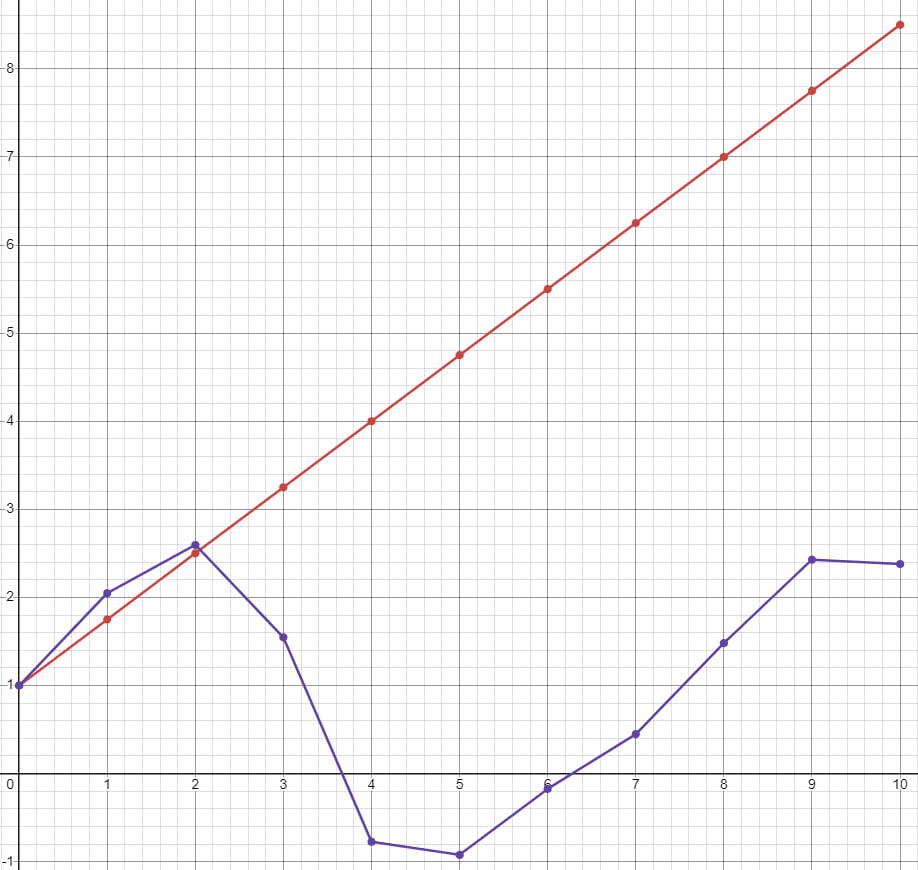

<p align="center"> Министерство образования Республики Беларусь</p>
<p align="center">Учреждение образования</p>
<p align="center">“Брестский Государственный технический университет”</p>
<p align="center">Кафедра ИИТ</p>
<br><br><br><br><br><br><br>
<p align="center">Лабораторная работа №1</p>
<p align="center">По дисциплине “Общая теория интеллектуальных систем”</p>
<p align="center">Тема: “Моделирования температуры объекта”</p>
<br><br><br><br><br>
<p align="right">Выполнил:</p>
<p align="right">Студент 2 курса</p>
<p align="right">Группы ИИ-26</p>
<p align="right">Кушнеревич Е. А.</p>
<p align="right">Проверила:</p>
<p align="right">Ситковец Я. С.</p>
<br><br><br><br><br>
<p align="center">Брест 2024</p>

<hr>

# Общее задание #
1. Написать отчет по выполненной лабораторной работе №1 в .md формате (readme.md) и с помощью запроса на внесение изменений (**pull request**) разместить его в следующем каталоге: **trunk\ii0xxyy\task_01\doc** (где **xx** - номер группы, **yy** - номер студента, например **ii02102**).
2. Исходный код написанной программы разместить в каталоге: **trunk\ii0xxyy\task_01\src**.
## Task 1. Modeling controlled object ##
Let's get some object to be controlled. We want to control its temperature, which can be described by this differential equation:

$$\Large\frac{dy(\tau)}{d\tau}=\frac{u(\tau)}{C}+\frac{Y_0-y(\tau)}{RC} $$ (1)

where $\tau$ – time; $y(\tau)$ – input temperature; $u(\tau)$ – input warm; $Y_0$ – room temperature; $C,RC$ – some constants.

After transformation, we get these linear (2) and nonlinear (3) models:

$$\Large y_{\tau+1}=ay_{\tau}+bu_{\tau}$$ (2)
$$\Large y_{\tau+1}=ay_{\tau}-by_{\tau-1}^2+cu_{\tau}+d\sin(u_{\tau-1})$$ (3)

where $\tau$ – time discrete moments ($1,2,3{\dots}n$); $a,b,c,d$ – some constants.

Task is to write program (**С++**), which simulates this object temperature.

<hr>

# Выполнение задания #

Код программы:
```C++
#include <iostream>
#include <cmath> // Для функции sin()
using namespace std;

// Линейная модель: y_(t+1) = a * y_(t) + b * u_(t)
void simulateLinearModel(double a, double b, double y0, double u0, int num_steps) {
    double y = y0; // Начальная температура
    double u = u0; // Начальный управляющий сигнал

    cout << "Линейная модель:\n";
    for (int t = 0; t < num_steps; ++t) {
        double y_next = a * y + b * u;
        cout << "Шаг времени " << t << ": Температура = " << y_next << std::endl;
        y = y_next; // Обновляем температуру
    }
}

// Нелинейная модель: y_(t+1) = a * y_(t) - b * y^2_(t-1) + c * u_(t) + d * sin(u_(t))
void simulateNonlinearModel(double a, double b, double c, double d, double y0, double u0, int num_steps) {
    double y_prev = y0; // Температура на шаге t-1
    double y = y0; // Начальная температура
    double u = u0; // Начальный тепло
    cout << "\nНелинейная модель:\n";
    for (int t = 0; t < num_steps; ++t) {
        double y_next = a * y - b * y_prev * y_prev + c * u + d * sin(u);
        cout << "Шаг времени " << t << ": Температура = " << y_next << std::endl;
        y_prev = y; // Обновляем y_(t-1)
        y = y_next; // Обновляем y_(t)
    }
}

int main() {
    setlocale(LC_ALL, "Russian");
    // Переменные для входных данных
    double a, b, c, d;
    double initial_temperature, initial_input;
    int num_steps;

    // Ввод данных
    cout << "Введите значение параметра a: ";
    cin >> a;

   cout << "Введите значение параметра b: ";
   cin >> b;

    cout << "Введите значение параметра c (для нелинейной модели): ";
    cin >> c;

    cout << "Введите значение параметра d (для нелинейной модели): ";
    cin >> d;

    cout << "Введите начальное значение температуры y0: ";
    cin >> initial_temperature;

    cout << "Введите начальное значение управляющего сигнала u0: ";
    cin >> initial_input;

    cout << "Введите количество шагов моделирования: ";
    cin >> num_steps;

    // Запуск симуляций
    simulateLinearModel(a, b, initial_temperature, initial_input, num_steps);
    simulateNonlinearModel(a, b, c, d, initial_temperature, initial_input, num_steps);

    return 0;
}
```     
```
Введите значение параметра a: 1
Введите значение параметра b: 0.08
Введите значение параметра c (для нелинейной модели): 0.3
Введите значение параметра d (для нелинейной модели): 0.5
Введите начальное значение температуры y0: 30
Введите начальное значение управляющего сигнала u0: 15
Введите количество шагов моделирования: 10
Линейная модель:
Шаг времени 0: Температура = 31.2
Шаг времени 1: Температура = 32.4
Шаг времени 2: Температура = 33.6
Шаг времени 3: Температура = 34.8
Шаг времени 4: Температура = 36
Шаг времени 5: Температура = 37.2
Шаг времени 6: Температура = 38.4
Шаг времени 7: Температура = 39.6
Шаг времени 8: Температура = 40.8
Шаг времени 9: Температура = 42

Нелинейная модель:
Шаг времени 0: Температура = -37.1749
Шаг времени 1: Температура = -104.35
Шаг времени 2: Температура = -210.082
Шаг времени 3: Температура = -1076.37
Шаг времени 4: Температура = -4602.3
Шаг времени 5: Температура = -97282.6
Шаг времени 6: Температура = -1.79177e+06
Шаг времени 7: Температура = -7.58904e+08
Шаг времени 8: Температура = -2.57595e+11
Шаг времени 9: Температура = -4.60751e+16

