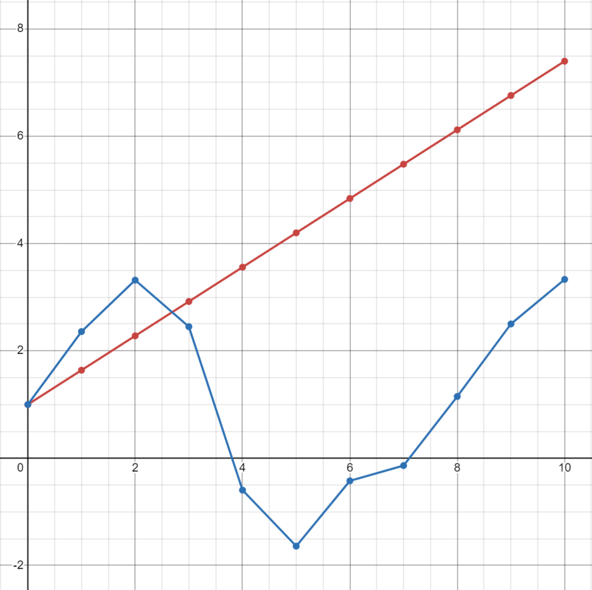

<p align="center"> Министерство образования Республики Беларусь</p>
<p align="center">Учреждение образования</p>
<p align="center">“Брестский Государственный технический университет”</p>
<p align="center">Кафедра ИИТ</p>
<br><br><br><br><br><br><br>
<p align="center">Лабораторная работа №1</p>
<p align="center">По дисциплине “Общая теория интеллектуальных систем”</p>
<p align="center">Тема: “Моделирования температуры объекта”</p>
<br><br><br><br><br>
<p align="right">Выполнил:</p>
<p align="right">Студент 2 курса</p>
<p align="right">Группы ИИ-26</p>
<p align="right">Прокопюк А.Д.</p>
<p align="right">Проверил:</p>
<p align="right">Ситковец Я.С.</p>
<br><br><br><br><br>
<p align="center">Брест 2024</p>

<hr>

# Общее задание #
1. Написать отчет по выполненной лабораторной работе №1 в .md формате (readme.md) и с помощью запроса на внесение изменений (**pull request**) разместить его в следующем каталоге: **trunk\ii0xxyy\task_01\doc** (где **xx** - номер группы, **yy** - номер студента, например **ii02102**).
2. Исходный код написанной программы разместить в каталоге: **trunk\ii0xxyy\task_01\src**.
## Task 1. Modeling controlled object ##
Let's get some object to be controlled. We want to control its temperature, which can be described by this differential equation:

$$\Large\frac{dy(\tau)}{d\tau}=\frac{u(\tau)}{C}+\frac{Y_0-y(\tau)}{RC} $$ (1)

where $\tau$ – time; $y(\tau)$ – input temperature; $u(\tau)$ – input warm; $Y_0$ – room temperature; $C,RC$ – some constants.

After transformation, we get these linear (2) and nonlinear (3) models:

$$\Large y_{\tau+1}=ay_{\tau}+bu_{\tau}$$ (2)
$$\Large y_{\tau+1}=ay_{\tau}-by_{\tau-1}^2+cu_{\tau}+d\sin(u_{\tau-1})$$ (3)

where $\tau$ – time discrete moments ($1,2,3{\dots}n$); $a,b,c,d$ – some constants.

Task is to write program (**Julia**), which simulates this object temperature.

<hr>

# Выполнение задания #

Код программы:
```C++
#include <iostream>
#include <cmath>
#include <vector>
#include <iomanip>

double const a = 1.0;
double const b = 0.4;
double const c = 0.1;
double const d = 1.2;
double const u = 1.6;

std::vector<double> LinearMod(int t, double yt) {
    std::vector<double> linearResult(t);
    linearResult[0] = yt; // Начальное значение
    for (int i = 1; i < t; i++) {
        linearResult[i] = a * linearResult[i - 1] + b * u;
    }
    return linearResult;
}

std::vector<double> NonlinearMod(int t, double yt) {
    std::vector<double> nonlinearResult(t);
    nonlinearResult[0] = yt; // Начальное значение
    // Обработка первого получаемого значения
    if (t > 1) {
        nonlinearResult[1] = a * nonlinearResult[0] + c * u + d * sin(u); // y1
    }

    for (int i = 2; i < t; i++) {
        nonlinearResult[i] = a * nonlinearResult[i - 1] - b * pow(nonlinearResult[i - 2], 2) + c * u + d * sin(u);
    }

    return nonlinearResult;
}

int main() {
    setlocale(LC_ALL, "rus");

    double startTemperature;
    int times;
    std::vector<std::vector<double>> results;

    std::cout << "Введите стартовую температуру: ";
    std::cin >> startTemperature;
    std::cout << "Введите время(количество шагов): ";
    std::cin >> times;

    // Увеличиваем на 1, чтобы учесть начальную температуру
    times += 1;

    // Занесение результатов выполнения функций в массив
    results.push_back(LinearMod(times, startTemperature));
    results.push_back(NonlinearMod(times, startTemperature));

    // Вывод результатов
    std::cout << std::right << std::setw(10) << "Итерация"
        << std::setw(10) << std::right << "Линейная"
        << std::setw(13) << std::right << "Нелинейная" << std::endl;

    for (int i = 0; i < times; i++) {
        std::cout << std::right << std::setw(10) << i
            << std::setw(10) << results[0][i]
            << std::setw(13) << results[1][i] << std::endl;
    }

    return 0;
}
'''
'''
Введите стартовую температуру: 1
Введите время(количество шагов): 10
  Итерация  Линейная   Нелинейная
         0         1            1
         1      1.64      2.35949
         2      2.28      3.31898
         3      2.92      2.45159
         4      3.56    -0.595163
         5       4.2     -1.63979
         6      4.84    -0.421993
         7      5.48    -0.138075
         8      6.12      1.15018
         9      6.76      2.50204
        10       7.4      3.33237
'''
