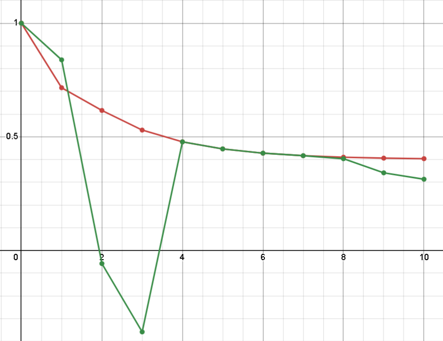

<p align="center"> Министерство образования Республики Беларусь</p>
<p align="center">Учреждение образования</p>
<p align="center">“Брестский Государственный технический университет”</p>
<p align="center">Кафедра ИИТ</p>
<br><br><br><br><br><br><br>
<p align="center">Лабораторная работа №1</p>
<p align="center">По дисциплине “Общая теория интеллектуальных систем”</p>
<p align="center">Тема: “Моделирования температуры объекта”</p>
<br><br><br><br><br>
<p align="right">Выполнил:</p>
<p align="right">Студент 2 курса</p>
<p align="right">Группы ИИ-26</p>
<p align="right">Рулько М.А.</p>
<p align="right">Проверила:</p>
<p align="right">Ситковец Я. С.</p>
<br><br><br><br><br>
<p align="center">Брест 2024</p>

<hr>

# Общее задание #
1. Написать отчет по выполненной лабораторной работе №1 в .md формате (readme.md) и с помощью запроса на внесение изменений (**pull request**) разместить его в следующем каталоге: **trunk\ii0xxyy\task_01\doc** (где **xx** - номер группы, **yy** - номер студента, например **ii02102**).
2. Исходный код написанной программы разместить в каталоге: **trunk\ii0xxyy\task_01\src**.
## Task 1. Modeling controlled object ##
Let's get some object to be controlled. We want to control its temperature, which can be described by this differential equation:

$$\Large\frac{dy(\tau)}{d\tau}=\frac{u(\tau)}{C}+\frac{Y_0-y(\tau)}{RC} $$ (1)

where $\tau$ – time; $y(\tau)$ – input temperature; $u(\tau)$ – input warm; $Y_0$ – room temperature; $C,RC$ – some constants.

After transformation, we get these linear (2) and nonlinear (3) models:

$$\Large y_{\tau+1}=ay_{\tau}+bu_{\tau}$$ (2)
$$\Large y_{\tau+1}=ay_{\tau}-by_{\tau-1}^2+cu_{\tau}+d\sin(u_{\tau-1})$$ (3)

where $\tau$ – time discrete moments ($1,2,3{\dots}n$); $a,b,c,d$ – some constants.

Task is to write program (**C++**), which simulates this object temperature.

<hr>

# Выполнение задания #

Код программы:
```C++
#include <iostream>
#include <cmath>
#include <vector>
#include <iomanip>

using namespace std;

float альфа = 0.6, бета = 0.8, с = 0.2, дельта = 1.0, еpsilon = 0.2;

vector<float> Линейный(int шаг, float начальнаяТемпература) {
    vector<float> результат(шаг);
    результат[0] = начальнаяТемпература;

    for (int i = 1; i < шаг; ++i) {
        результат[i] = альфа * результат[i - 1] + бета * еpsilon;
    }
    return результат;
}

vector<float> Нелинейный(int шаг, float начальнаяТемпература) {
    vector<float> результат(шаг);
    результат[0] = начальнаяТемпература;

    if (шаг > 1) {
        результат[1] = альфа * результат[0] + с * еpsilon + дельта * sin(epsilon);
    }
    
    for (int i = 2; i < шаг; ++i) {
        результат[i] = альфа * результат[i - 1] - бета * pow(результат[i - 2], 2) + с * еpsilon + дельта * sin(epsilon);
    }
    return результат;
}

int main() {
    setlocale(LC_ALL, "Russian");
    float начальнаяТемпература;
    int шаг;
    vector<vector<float>> результаты;

    cout << "Введите начальное значение T: ";
    cin >> начальнаяТемпература;

    cout << "Введите количество шагов: ";
    cin >> шаг;
    шаг++;

    результаты.push_back(Линейный(шаг, начальнаяТемпература));
    результаты.push_back(Нелинейный(шаг, начальнаяТемпература));

    cout << right << setw(10) << "Ит:" << setw(10) << right << "Линейный" << setw(13) << right << "Нелинейный" << endl;

    for (int i = 0; i < шаг; ++i) {
        cout << right << setw(10) << i << setw(10) << результаты[0][i] << setw(13) << результаты[1][i] << endl;
    }

    return 0;
}
```     
```
Введите начальное T: 1
Введите шаг: 10
       It:    Linear    No-Linear
         0         1            1
         1      0.76     0.838669
         2     0.616    -0.058129
         3    0.5296    -0.358901
         4   0.47776    0.0206255
         5  0.446656     0.147997
         6  0.427994     0.327127
         7  0.416796     0.417423
         8  0.410078     0.403514
         9  0.406047     0.341384
        10  0.403628     0.313241
```
