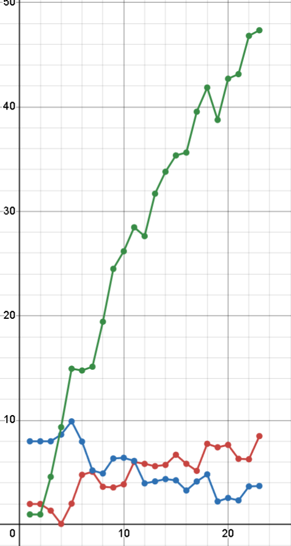

<p align="center"> Министерство образования Республики Беларусь</p>
<p align="center">Учреждение образования</p>
<p align="center">“Брестский Государственный технический университет”</p>
<p align="center">Кафедра ИИТ</p>
<br><br><br><br><br><br><br>
<p align="center">Лабораторная работа №2</p>
<p align="center">По дисциплине “Общая теория интеллектуальных систем”</p>
<p align="center">Тема: “ПИД-регуляторы”</p>
<br><br><br><br><br>
<p align="right">Выполнил:</p>
<p align="right">Студент 2 курса</p>
<p align="right">Группы ИИ-26</p>
<p align="right">Семёнов А.В.</p>
<p align="right">Проверила:</p>
<p align="right">Ситковец Я. С.</p>
<br><br><br><br><br>
<p align="center">Брест 2024</p>

<hr>

# Общее задание #
1. Написать отчет по выполненной лабораторной работе №1 в .md формате (readme.md) и с помощью запроса на внесение изменений (**pull request**) разместить его в следующем каталоге: **trunk\ii0xxyy\task_02\doc** (где **xx** - номер группы, **yy** - номер студента, например **ii02302**).
2. Исходный код написанной программы разместить в каталоге: **trunk\ii0xxyy\task_02\src**.

# Задание #
Задание. На C++ реализовать программу, моделирующую рассмотренный выше ПИД-регулятор. В качестве объекта управления использовать математическую модель, полученную в предыдущей работе. В отчете также привести графики для разных заданий температуры объекта, пояснить полученные результаты.


<hr>

# Выполнение задания #

Код программы:
```C++
#include <iostream>
#include <cmath>
#include <vector>
#include <iomanip>

using namespace std;

int main() {
    float alpha = 0.6, beta = 0.8, gamma = 0.2, delta = 1.0;
    float K = 0.9, initial_time = 0.5, ts = 1.0, td = 0.5, output = 10;
    float q0 = K * (1 + (td / initial_time)),
          q1 = -K * (1 + 2 * (td / initial_time) - (initial_time / ts)),
          q2 = K * (td / initial_time);
    
    const short int n = 2;
    vector<float> result = {n, n};
    vector<float> error = {output - n, output - n};
    float control = 1;
    vector<float> ctrl = {control, control};
    
    while (abs(output - result.back()) > 1) {
        error.push_back(output - result.back());
        control = ctrl.back() + q0 * error.back() + q1 * error[error.size() - 2] + q2 * error[error.size() - 3];
        result.push_back(alpha * result.back() - beta * result[result.size() - 2] + gamma * control + delta * sin(ctrl.back()));
        ctrl.push_back(control);
    }
    
    cout << right << setw(10) << "It" << setw(10) << right << "Output" << setw(13) << right << "Error"
         << setw(13) << right << "Control" << endl;
    
    for (int i = 0; i < result.size(); i++) {
        cout << right << setw(10) << i + 1 << setw(10) << result[i] << setw(13) << error[i] << setw(13) << ctrl[i] << endl;
    }
    
    return 0;
}
'''
Вывод:
'''
 It    Output        Error      Control
         1         2            8            1
         2         2            8            1
         3   1.36147            8          4.6
         4 0.0930618      8.63853      9.34935
         5   2.03105      9.90694      14.9451
         6    4.7898      7.96895      14.7733
         7   5.08098       5.2102      15.1378
         8   3.64476      4.91902      19.4411
         9   3.58012      6.35524       24.502
        10    3.8796      6.41988      26.1855
        11   6.02793       6.1204      28.4773
        12   5.83833      3.97207       27.634
        13   5.61737      4.16167      31.6962
        14   5.73557      4.38263       33.796
        15   6.70877      4.26443      35.3566
        16   5.84614      3.29123      35.6302
        17   5.17015      4.15386      39.5399
        18   7.75887      4.82985      41.8495
        19   7.42397      2.24113      38.7549
        20   7.65677      2.57603       42.696
        21   6.32205      2.34323      43.1348
        22   6.27844      3.67795      46.8013
        23    8.4932      3.72156      47.3336
        24   8.86149       1.5068      44.9825
        25   8.76209      1.13851      46.9909
        26   7.90339      1.23791      48.0136
        27   6.96084      2.09661      50.0269
        28   7.99626      3.03916      51.8941
        29   10.3373      2.00374      50.5497
'''
