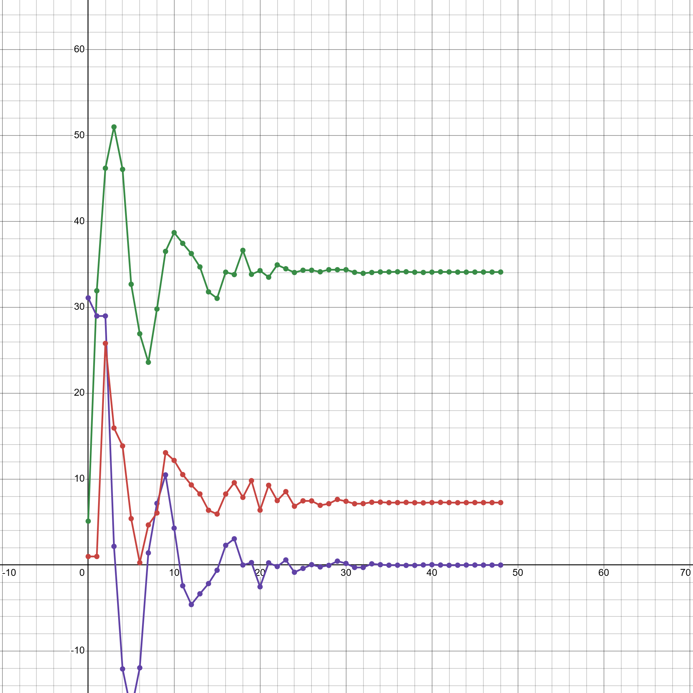

<p align="center"> Министерство образования Республики Беларусь</p>
<p align="center">Учреждение образования</p>
<p align="center">“Брестский Государственный технический университет”</p>
<p align="center">Кафедра ИИТ</p>
<br><br><br><br><br><br><br>
<p align="center">Лабораторная работа №2</p>
<p align="center">По дисциплине “Общая теория интеллектуальных систем”</p>
<p align="center">Тема: “ПИД-регуляторы”</p>
<br><br><br><br><br>
<p align="right">Выполнил:</p>
<p align="right">Студентка 2 курса</p>
<p align="right">Группы ИИ-25</p>
<p align="right">Мархель А. Д.</p>
<p align="right">Проверил:</p>
<p align="right">Иванюк Д. С.</p>
<br><br><br><br><br>
<p align="center">Брест 2024</p>

<hr>

# Общее задание #
1. Написать отчет по выполненной лабораторной работе №1 в .md формате (readme.md) и с помощью запроса на внесение изменений (pull request) разместить его в следующем каталоге: trunk\ii0xxyy\task_02\doc (где xx - номер группы, yy - номер студента, например ii02302)..
2. Исходный код написанной программы разместить в каталоге: **trunk\ii0xxyy\task_01\src**.
## Задание ##
Задание. На C++ реализовать программу, моделирующую рассмотренный выше ПИД-регулятор. В качестве объекта управления использовать математическую модель, полученную в предыдущей работе. В отчете также привести графики для разных заданий температуры объекта, пояснить полученные результаты.

<hr>

# Выполнение задания #

Код программы:


```
1) y[0] = 2             e[0] = 18          u_pr[0] = 1
2) y[1] = 2             e[1] = 18          u_pr[1] = 1
3) y[2] = 9.54488             e[2] = 18          u_pr[2] = 15.4
4) y[3] = 14.7205             e[3] = 10.4551          u_pr[3] = 18.2769
5) y[4] = 15.8424             e[4] = 5.27954          u_pr[4] = 24.2237
6) y[5] = 16.9143             e[5] = 4.15761          u_pr[5] = 30.4979
7) y[6] = 18.2768             e[6] = 3.08572          u_pr[6] = 33.0028
8) y[7] = 20.0918             e[7] = 1.72325          u_pr[7] = 34.1701
9) y[8] = 19.567             e[8] = -0.0917899          u_pr[8] = 33.7675
10) y[9] = 19.644             e[9] = 0.432959          u_pr[9] = 35.8156
11) y[10] = 18.9085             e[10] = 0.35601          u_pr[10] = 35.6628
12) y[11] = 19.4078             e[11] = 1.09146          u_pr[11] = 37.1268
13) y[12] = 20.0554             e[12] = 0.592205          u_pr[12] = 36.7026
14) y[13] = 19.8095             e[13] = -0.055358          u_pr[13] = 36.5504
15) y[14] = 19.7358             e[14] = 0.190501          u_pr[14] = 37.3526
16) y[15] = 20.2417             e[15] = 0.264249          u_pr[15] = 37.4388
17) y[16] = 20.2193             e[16] = -0.241687          u_pr[16] = 36.8239
18) y[17] = 19.7236             e[17] = -0.219299          u_pr[17] = 37.0327
19) y[18] = 19.9181             e[18] = 0.276374          u_pr[18] = 37.598
20) y[19] = 20.3612             e[19] = 0.0818919          u_pr[19] = 37.1616
21) y[20] = 19.9376             e[20] = -0.361241          u_pr[20] = 36.6917
22) y[21] = 19.668             e[21] = 0.0624235          u_pr[21] = 37.3721
23) y[22] = 20.1941             e[22] = 0.331975          u_pr[22] = 37.5256
24) y[23] = 20.2676             e[23] = -0.194062          u_pr[23] = 36.7917
25) y[24] = 19.6886             e[24] = -0.267637          u_pr[24] = 36.9067
26) y[25] = 19.8347             e[25] = 0.311366          u_pr[25] = 37.6304
27) y[26] = 20.4041             e[26] = 0.165296          u_pr[26] = 37.2353
28) y[27] = 19.9953             e[27] = -0.404112          u_pr[27] = 36.6041

C:\Users\user\source\repos\ConsoleApplication1\x64\Debug\ConsoleApplication1.exe (процесс 20156) завершил работу с кодом 0.
```

