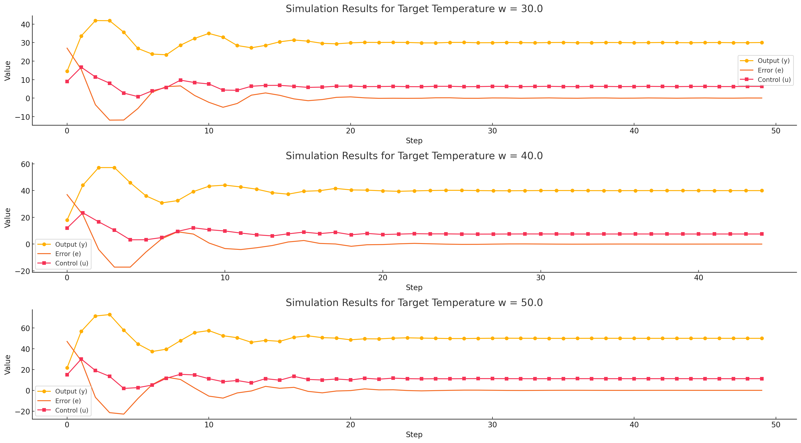

<p align="center"> Министерство образования Республики Беларусь</p>
<p align="center">Учреждение образования</p>
<p align="center">“Брестский Государственный технический университет”</p>
<p align="center">Кафедра ИИТ</p>
<br><br><br><br><br><br><br>
<p align="center">Лабораторная работа №2</p>
<p align="center">По дисциплине “Общая теория интеллектуальных систем”</p>
<p align="center">Тема: “ПИД-регуляторы”</p>
<br><br><br><br><br>
<p align="right">Выполнила:</p>
<p align="right">Студентка 2 курса</p>
<p align="right">Группы ИИ-26</p>
<p align="right">Черноиван А.Н.</p>
<p align="right">Проверил:</p>
<p align="right">Иванюк Д. С.</p>
<br><br><br><br><br>
<p align="center">Брест 2024</p>

<hr>

# Общее задание #
1. Написать отчет по выполненной лабораторной работе №1 в .md формате (readme.md) и с помощью запроса на внесение изменений (pull request) разместить его в следующем каталоге: trunk\ii0xxyy\task_02\doc (где xx - номер группы, yy - номер студента, например ii02302)..
2. Исходный код написанной программы разместить в каталоге: **trunk\ii0xxyy\task_01\src**.
## Задание ##
Задание. На C++ реализовать программу, моделирующую рассмотренный выше ПИД-регулятор. В качестве объекта управления использовать математическую модель, полученную в предыдущей работе. В отчете также привести графики для разных заданий температуры объекта, пояснить полученные результаты.

<hr>

# Выполнение задания #

Код программы:
```#include <iostream>
#include <vector>
#include <iomanip> 
#include <cmath>

using namespace std;

// Определяем структуру для хранения результатов
struct SimulationResult {
    double step;   // Номер шага
    double output; // Выход y
    double error;  // Ошибка e
    double control; // Управление u

    SimulationResult(double s, double out, double err, double ctrl)
        : step(s), output(out), error(err), control(ctrl) {}
};

// Функция для инициализации констант и переменных
void initializeVariables(double& alpha, double& b, double& c, double& d,
                         double& K, double& T0, double& TD, double& T,
                         double& w, double& q0, double& q1, double& q2,
                         short int& yStart, double& u) {
    alpha = 0.95;
    b = 0.2;
    c = 1.2;
    d = 1;
    K = 0.73;
    T0 = 1.4;
    TD = 1.0;
    T = 1.25;
    w = 34.1;

    q0 = K * (1 + TD / T0);
    q1 = -K * (1 + 2 * TD / T0 - T0 / T);
    q2 = K * (TD / T0);

    yStart = 3;
    u = 1.0;
}

// Функция для отображения результатов в виде таблицы
void displayResults(const vector<SimulationResult>& results) {
    cout << "Результаты симуляции контроллера:\n";
    cout << left << setw(15) << "Шаг"
         << setw(25) << "Выход y"
         << setw(25) << "Ошибка e"
         << setw(25) << "Управление u" << endl;

    cout << string(75, '-') << endl; // Разделитель

    // Используем традиционный цикл for
    for (size_t i = 0; i < results.size(); ++i) {
        const SimulationResult& result = results[i];
        cout << setw(10) << result.step
             << setw(20) << fixed << setprecision(4) << result.output
             << setw(20) << fixed << setprecision(4) << result.error
             << setw(25) << fixed << setprecision(4) << result.control << endl;
    }
}

void nonlinearModel() {
    double alpha, b, c, d, K, T0, TD, T, w, q0, q1, q2;
    short int yStart;
    double u;

    // Инициализация переменных
    initializeVariables(alpha, b, c, d, K, T0, TD, T, w, q0, q1, q2, yStart, u);

    vector<SimulationResult> results; // Вектор для хранения результатов
    vector<double> y;
    vector<double> u_pred(2, u);
    y.push_back(alpha * yStart + c * u + d * sin(u));

    vector<double> e; // Объявляем вектор e
    e.push_back(w - yStart); // Добавляем первый элемент
    e.push_back(w - y.back()); // Добавляем второй элемент

    // Итеративный контрольный цикл
    int step = 0;
    while (abs(e.back()) > 0.001) {
        e.push_back(w - y.back());
        u = u_pred.back() + q0 * e.back() + q1 * e[e.size() - 2] + q2 * e[e.size() - 3];
        y.push_back(alpha * y.back() - b * y[y.size() - 2] + c * u + d * sin(u_pred.back()));
        u_pred.push_back(u);

        // Сохраняем результаты
        results.emplace_back(step++, y.back(), e.back(), u);
    }

    // Отображение результатов
    displayResults(results);
}

int main() {
    nonlinearModel();
    return 0;
}
```     
```
Результаты симуляции контроллера:
Шаг         Выход y             Ошибка e           Управление u   
---------------------------------------------------------------------------
0         36.5290             29.2085             25.8672                  
1.0000    46.5816             -2.4290             10.1560                  
2.0000    50.7829             -12.4816            12.0866                  
3.0000    40.7048             -16.6829            1.8658                   
4.0000    33.1040             -6.6048             3.0285                   
5.0000    25.6830             0.9960              1.8853                   
6.0000    28.3568             8.4170              8.0232                   
7.0000    32.0152             5.7432              7.6893                   
8.0000    36.7706             2.0848              9.2008                   
9.0000    36.9854             -2.6706             6.8620                   
10.0000   36.5961             -2.8854             6.8892                   
11.0000   34.0940             -2.4961             5.1293                   
12.0000   31.3758             0.0060              6.0167                   
13.0000   32.4672             2.7242              8.1186                   
14.0000   34.6092             1.6328              7.5628                   
15.0000   35.4867             -0.5092             6.7863                   
16.0000   34.9391             -1.3867             6.3887                   
17.0000   33.8775             -0.8391             6.3978                   
18.0000   33.4158             0.2225              6.7548                   
19.0000   33.7768             0.6842              6.9609                   
20.0000   34.2251             0.3232              6.8277                   
21.0000   34.3396             -0.1251             6.7192                   
22.0000   34.2489             -0.2396             6.7074                   
23.0000   34.1019             -0.1489             6.6848                   
24.0000   33.9775             -0.0019             6.6997                   
25.0000   33.9954             0.1225              6.7771                   
26.0000   34.1223             0.1046              6.7900                   
27.0000   34.1738             -0.0223             6.7261                   
28.0000   34.1207             -0.0738             6.7095                   
29.0000   34.0845             -0.0207             6.7425                   
30.0000   34.0914             0.0155              6.7432                   
31.0000   34.0880             0.0086              6.7284                   
32.0000   34.0879             0.0120              6.7433                   
33.0000   34.1117             0.0121              6.7514                   
34.0000   34.1177             -0.0117             6.7315                   
35.0000   34.0952             -0.0177             6.7269                   
36.0000   34.0886             0.0048              6.7437                   
37.0000   34.1025             0.0114              6.7441                   
38.0000   34.1036             -0.0025             6.7326                   
39.0000   34.0961             -0.0036             6.7364                   
40.0000   34.1006             0.0039              6.7434                   
41.0000   34.1050             -0.0006             6.7371   
```

